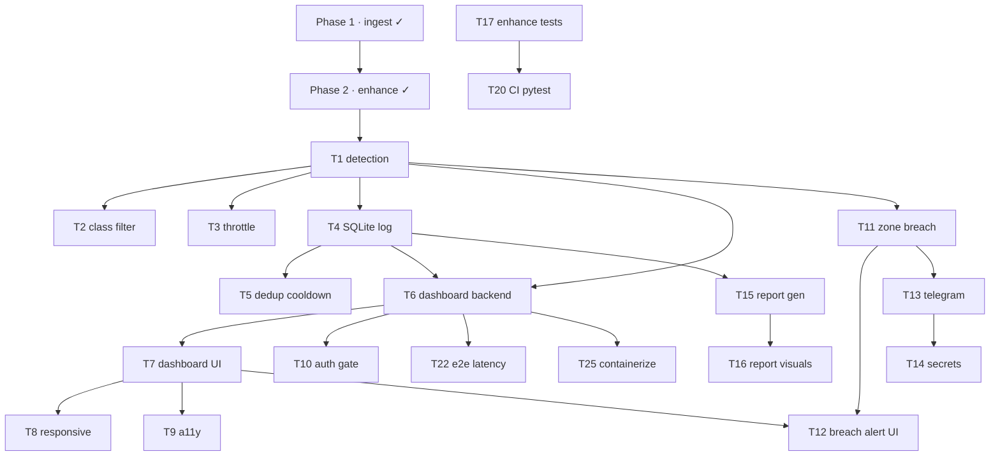

# Sentinel — Engineering Workflow & Delivery Plan

This repository runs a **production-team GitHub workflow** despite a single
primary developer. This document is the source of truth for how work is planned,
branched, reviewed, and released. It is authored and owned by the engineering
lead and enforced through branch protection, CI, `CODEOWNERS`, and PR review.

- **Process rules:** [`CONTRIBUTING.md`](../CONTRIBUTING.md)
- **Product/architecture:** [`README.md`](../README.md)

---

## 1. Operating principles

1. **Issue-first.** No work exists until it is an Issue with acceptance criteria.
2. **One issue → one branch → one PR.** Unrelated work is split, always.
3. **`main` is protected.** It only advances through reviewed, CI-green PRs.
4. **Small, reviewable PRs.** Target < ~400 lines of diff.
5. **Conventional Commits** everywhere — history is a changelog.
6. **Every PR is reviewed** against the 12-point checklist in §6.

---

## 2. Milestones (delivery roadmap)

| # | Milestone | Outcome | Exit criteria |
|---|-----------|---------|---------------|
| M1 | **MVP Pipeline** | `ingest → enhance → detect → log` runs end-to-end | Detections persisted to SQLite from a live feed |
| M2 | **Live Dashboard** | FastAPI + WebSocket UI with video, feed, counters | Judges can watch detections live in a browser |
| M3 | **Alerting & Response** | Zone breach → dashboard alert + Telegram snapshot | Person entering a drawn zone fires both alerts |
| M4 | **Post-Flight Reporting** | Presentable HTML session report | One command produces a judge-ready report |
| M5 | **Testing & Hardening** | Tests, CI gates, security & perf passes | CI enforces lint + tests; no plaintext secrets |
| M6 | **Production Release v1.0** | Packaged, versioned, containerized | Tagged `v1.0.0` with release notes + image |
| M7 | **v1.1 Custom Control** *(stretch)* | Recover vendor protocol, minimal controller | Documented stream URL + takeoff/land command |

**Completed pre-backlog:** Phase 1 (ingest) and Phase 2 (enhance) are already
merged into `main` and underpin M1.

---

## 3. Label taxonomy

**Type:** `feature` · `bug` · `enhancement` · `documentation` · `testing`
**Domain:** `frontend` · `backend` · `database` · `api` · `ai` · `ui` · `ux` ·
`accessibility` · `mobile` · `security` · `performance` · `devops` · `deployment` ·
`integration`
**Priority:** `high priority` · `medium priority` · `low priority`
**Workflow state:** `in progress` · `needs review` · `ready to merge` · `blocked` ·
`help wanted` · `good first issue`

---

## 4. Branch strategy

Trunk-based with short-lived branches off `main`:

```
<type>/<slug>
feature/detection      fix/screen-sleep-frames     refactor/frame-source
perf/detection-throttle  test/enhance-controller    docs/setup-guide
security/secrets-config  ci/pytest-coverage         devops/containerize
```

- Branch from the latest `main`; rebase (don't merge) `main` back in if it moves.
- Delete the branch on merge (squash-merge keeps `main` linear).
- One branch never serves two issues.

---

## 5. Pull Request workflow

1. Open the PR early as **Draft**; label `in progress`.
2. PR title = Conventional Commit; body uses the repo PR template; must contain
   `Closes #<issue>`.
3. When ready: mark **Ready for review**, relabel `needs review`, assign the
   `CODEOWNERS` reviewer.
4. Reviewer works the §6 checklist and leaves line comments. Author addresses
   every thread.
5. On approval + green CI: relabel `ready to merge`, **squash-merge**, branch
   auto-deletes, issue auto-closes, board card moves to **Done**.

Every PR states its **Testing instructions**, **Risks**, and **Rollback plan**
(default rollback: `git revert <squash-sha>`).

---

## 6. Code-review checklist (Senior Engineer lens)

| Dimension | What the reviewer verifies |
|-----------|----------------------------|
| Architecture | Correct layer; depends on abstractions (`FrameSource`), not concretions |
| SOLID | Single responsibility per class/function; open for extension |
| Naming | Intention-revealing; matches surrounding module vocabulary |
| Clean code | No dead code, no commented-out blocks, no magic numbers |
| Security | No secrets in code; inputs validated; least privilege |
| Performance | No per-frame allocations in the hot loop; no blocking I/O on the frame thread |
| Readability | A newcomer can follow it; comments explain *why*, not *what* |
| Accessibility | UI has semantics, contrast, keyboard paths |
| Error handling | Failures are caught, logged, and recoverable (reconnect, retries) |
| Edge cases | Empty/corrupt frame, dropped stream, zero detections, huge bbox |
| Scalability | Works as frame size / detection count grows |
| Maintainability | Tested, documented, configured via dataclasses not literals |

---

## 7. Project board (Kanban)

GitHub Project (v2) named **Sentinel Delivery** with columns:

`Backlog → Ready → In Progress → Review → Testing → Done`

Automation: new issues → **Backlog**; assigned + unblocked → **Ready**; PR opened
→ **In Progress**; review requested → **Review**; CI passing / QA → **Testing**;
PR merged → **Done**.

> Board creation requires the `project` OAuth scope. See the setup note in the
> repository summary to enable it, or create it in the GitHub UI using the columns
> above. All other artifacts (issues, labels, milestones) are already live.

---

## 8. Issue backlog

Internal IDs (`T#`) are stable references used by the dependency graph; GitHub
assigns the live issue numbers on creation.

### M1 · MVP Pipeline
| ID | Title | Branch | Labels | Effort | Depends on |
|----|-------|--------|--------|--------|-----------|
| T1 | `feat(detect): YOLOv8n detection stage` | `feature/detection` | feature, ai, backend, high | M | Phase 2 |
| T2 | `feat(detect): class filter & confidence threshold` | `feature/detection-config` | feature, ai | S | T1 |
| T3 | `perf(detect): inference throttling / frame-skip` | `perf/detection-throttle` | performance, ai | S | T1 |
| T4 | `feat(log): SQLite event logging schema & writer` | `feature/event-logging` | feature, database, backend, high | M | T1 |
| T5 | `feat(log): per-class cooldown de-duplication` | `feature/log-dedup` | feature, database | S | T4 |

### M2 · Live Dashboard
| ID | Title | Branch | Labels | Effort | Depends on |
|----|-------|--------|--------|--------|-----------|
| T6 | `feat(dashboard): FastAPI + WebSocket backend` | `feature/dashboard-backend` | feature, backend, api, high | L | T1, T4 |
| T7 | `feat(dashboard): live video, event feed, counters` | `feature/dashboard-ui` | feature, frontend, ui | L | T6 |
| T8 | `feat(dashboard): responsive / mobile layout` | `feature/dashboard-responsive` | frontend, ui, ux, mobile | M | T7 |
| T9 | `feat(dashboard): accessibility pass` | `feature/dashboard-a11y` | accessibility, ux, frontend | S | T7 |
| T10 | `security(dashboard): access-token gate` | `security/dashboard-auth` | security, backend, api | S | T6 |

### M3 · Alerting & Response
| ID | Title | Branch | Labels | Effort | Depends on |
|----|-------|--------|--------|--------|-----------|
| T11 | `feat(alert): restricted-zone draw & overlap detection` | `feature/zone-breach` | feature, backend, high | M | T1 |
| T12 | `feat(alert): dashboard visual breach alert` | `feature/breach-alert-ui` | feature, frontend, ui | S | T11, T7 |
| T13 | `feat(alert): Telegram notification with snapshot` | `feature/telegram-alert` | feature, api, integration | M | T11 |
| T14 | `security(alert): externalize secrets & config` | `security/secrets-config` | security, high | S | T13 |

### M4 · Post-Flight Reporting
| ID | Title | Branch | Labels | Effort | Depends on |
|----|-------|--------|--------|--------|-----------|
| T15 | `feat(report): post-flight HTML report generator` | `feature/postflight-report` | feature, backend | M | T4 |
| T16 | `feat(report): thumbnails, timeline & summary stats` | `feature/report-visuals` | feature, ui | M | T15 |

### M5 · Testing & Hardening
| ID | Title | Branch | Labels | Effort | Depends on |
|----|-------|--------|--------|--------|-----------|
| T17 | `test(enhance): adaptive controller unit tests` | `test/enhance-controller` | testing | S | Phase 2 |
| T18 | `test(ingest): fallback ladder integration tests` | `test/ingest-fallback` | testing | S | Phase 1 |
| T19 | `test(detect): detector tests with fixture image` | `test/detection` | testing, ai | S | T1 |
| T20 | `ci: pytest + coverage gate in CI` | `ci/pytest-coverage` | testing, devops | S | T17 |
| T21 | `security: dependency & secret scanning` | `devops/security-scanning` | security, devops | S | — |
| T22 | `perf: end-to-end latency profiling & budget` | `perf/e2e-latency` | performance | M | T6 |
| T23 | `docs: setup guide, stream cookbook & architecture` | `docs/setup-guide` | documentation | M | — |

### M6 · Production Release v1.0
| ID | Title | Branch | Labels | Effort | Depends on |
|----|-------|--------|--------|--------|-----------|
| T24 | `chore(release): v1.0 packaging, versioning, notes` | `chore/release-v1` | deployment, devops, high | S | M1–M5 |
| T25 | `ci(deploy): Dockerfile + compose for dashboard` | `devops/containerize` | deployment, devops | M | T6 |

### M7 · v1.1 Custom Control (stretch)
| ID | Title | Branch | Labels | Effort | Depends on |
|----|-------|--------|--------|--------|-----------|
| T26 | `feat(control): decompile vendor APK (JADX) for protocol` | `feature/apk-recon` | feature, help wanted, low | L | — |
| T27 | `feat(control): minimal drone controller (takeoff/land/move)` | `feature/drone-controller` | feature, low | L | T26 |

### Cross-cutting bug
| ID | Title | Branch | Labels | Effort | Depends on |
|----|-------|--------|--------|--------|-----------|
| T28 | `fix(ingest): screen source black frames when display asleep` | `fix/screen-sleep-frames` | bug, medium | XS | Phase 1 |

---

## 9. Dependency graph



---

## 10. Development order (critical path)

The shortest path to a demoable system, respecting dependencies:

1. **T1** detection → **T4** logging → **T5** dedup  *(MVP perception complete)*
2. **T6** dashboard backend → **T7** dashboard UI  *(live visualization)*
3. **T11** zone breach → **T12** dashboard alert → **T13** Telegram  *(the "wow")*
4. **T15 → T16** post-flight report  *(judge takeaway)*
5. Parallel throughout: **T17–T20** tests + CI, **T23** docs, **T21** security scan
6. **T24** release cut → **T25** container  *(v1.0)*
7. Stretch: **T26 → T27** custom control  *(v1.1)*

`T2`, `T3`, `T8`, `T9`, `T10`, `T22`, `T28` are quality/hardening tasks that ride
alongside the critical path and are pulled in as capacity allows.
